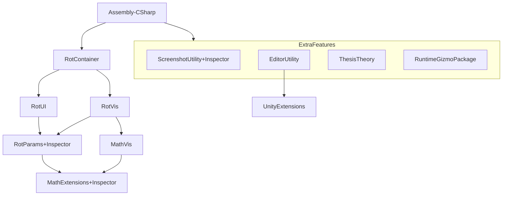

## PHASE 1 - DEFINITION

### 1. XY-Chain & Specificity (e.g. not "solve UI", but "user can't find item XY in UI":
- Math_Stuff Exportable
- Math_Stuff reusable via minimal effort (e.g. as unity-package)
- Order Assets into clusters (e.g. Math cluster, UI cluster, ...)

### 2. Description
| **input**      | **behaviour**           | **constraints**  | **output**       |
|----------------|-------------------------|------------------|------------------|
| Current Assets | Export / Import Content | 5 min setup time | Bundled Features |

### 3. Rice:
| Reach (#use-cases) | Impact (0-3) | Confidence | Est. Effort |
|--------------------|--------------|------------|-------------|
| 1                  | 2            | low        | 1/2 day     |

Begin-Time: 2026-10-03, 14:00
Finish-Time: 2026-10-03, 16:45

-> switch (use-case * impact): 
- <=3: brute-force <= 1h or backlog  
=> actually I shouldn't necessarily do the whole restructuring, because I don't need the math-plugin right now, nor is it sure whether I need it some time in the near feature; It would probably make more sense to only extract ones I need to extract everything; For now I can keep things in their assembly definitions  
=> Correction: Half of the work is already done; Thus I should probably fix stuff, so that I don't leave it in a half-finished state. 

### 4. Kill Duck: 
am I creating this, only because it ... (strike-through wrong ones)
- ... appears cool?  
- ... helps an imaginary future? 
-> any yes = backlog
=> I am actually planning to separate all the modules, such that in a potential future I have themm available; But I don't know whether such a future will ever exist or whether I will just buy & install a math-plugin at that point.  
=> All I will do now is check the dependencies.   
=> See correction above. Since the work is already half-done I should not leave it in a messy state, but ensure that the dependencies are not all over the place. 

###  Workflow: : Summary : 

# ________

## PHASE 2 - DESIGN

### Research: 
switch (complexity): 
 - **similar**: similarity-table 

## PHASE 4 - POSTMORTEM:

### compare: 

work problems list: 
- mesh re-export/-import would take a lot of time ==> moved to later by an indefinite time

success list: 
- avoided steps that aren't necessary for now (e.g. mesh re-export/-import)
- visualised the structure, ensured all files are in correct location
- skipped the while Implementation step, because it wasn't necessary in this case

| estimated time | actual time |
|----------------|-------------|
| 1/2 day        | 1/4 day     |

# ________
