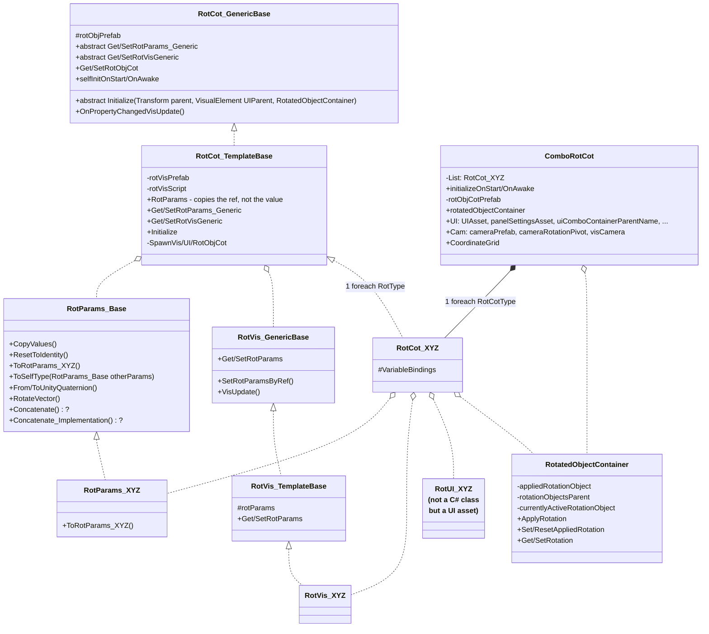
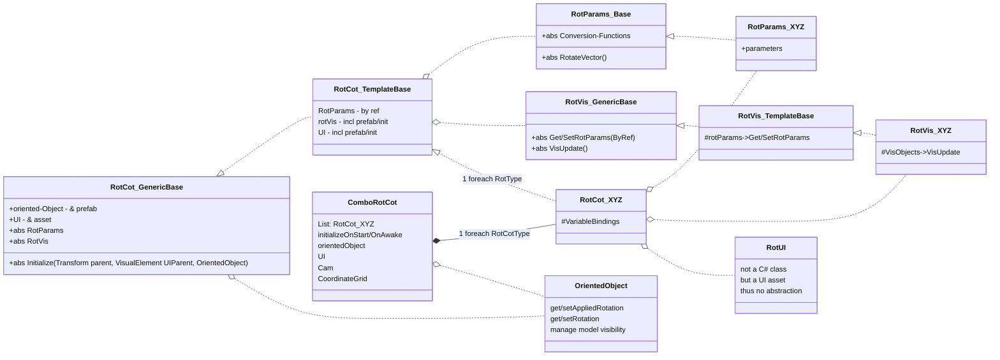
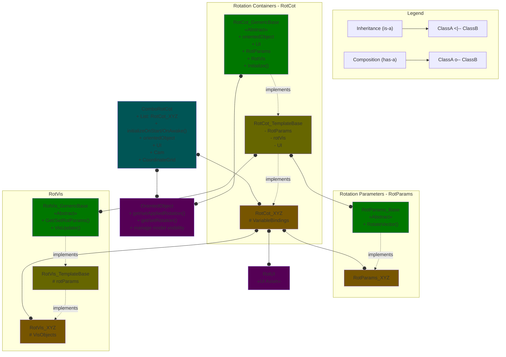

## PHASE 1 - DEFINITION

### 1. XY-Chain & Specificity (e.g. not "solve UI", but "user can't find item XY in UI":
- RotParams convert into one another
- User can convert from one RotParams to another
- -> User can convert from one RotParam+Vis+UI to another
- RotParams+Vis+UI Conversion is accesible from a cleanly documented location

### 2. Description
| **input**                                | **behaviour**                                            | **constraints** | **output**                       |
|------------------------------------------|----------------------------------------------------------|-----------------|----------------------------------|
| Click Dropdown -> other Parameterisation | convert RotParams, siwtch active Vis & UI(, bind UI/Vis) |                 | switched Parameterisation+Vis+UI |

### 3. Rice:
| Reach (#use-cases) | Impact (0-3) | Confidence | Est. Effort |
|--------------------|--------------|------------|-------------|
| 3                  | 3            | medium     | 1 day       |

Begin-Time: 2026-10-03, 17:06
Finish-Time: 

-> switch (use-case * impact): 
- \>=7: elegant solution

### 4. Kill Duck: 
am I creating this, only because it ... (strike-through wrong ones)
- ... is intellectually interesting?
- ~~... appears cool?~~  
- ~~... is fun to make?~~  
- ... helps an imaginary future? 

###  Workflow: : Summary : 
I need to be a bit careful, that I don't overdo the conversion system for some future parameterisations (that don't exist) or because some system seems innovative. 

# ________

## PHASE 2 - DESIGN

### Research: 
switch (complexity): 
 - **similar**: similarity-table 
 - **custom feature**: 
  - research <=min(0.5days, 3 answer) -> comparison table 
  - choose one and test <=(0.5day, acceptable test) -> result table

Simplified Class-Diagram: 

Simplified Color Coded Class Diagram

### Full Class-Diagram see Miro: https://miro.com/app/board/uXjVIMvwpDc=/

### Happy-Path: 
- ~~**default** (<= 1day): flowchart & rubber-duck~~
- **complex** (week): separate into tasks

Scene Setup -> see Miro

Initialization -> see Miro

Switch Rotation Type -> see Miro

### Kill Duck
- am I using this solution, only because it ...
- ... is intellectually interesting?
- ... appears cool?
- ... is fun to make?
- ... helps an imaginary future?
-> any yes = kill

### Happy-Path Summary:
The Scene Hierarchy starts with only the ComboRotCot and empty objects with the RotCot_XYZ_Scripts. 
Each RotCot has its own initialisation, which checks the references and spawns unreferenced objects based on its prefabs. 
The ComboRotCot wraps the RotCot-initialisation: First it initialises the UIDocument, Camera and OrientedObject, then it passes these onto the RotCot-initialisations; Lastly it deactivates all RotCots - except the one set as start. 

Switching from one RotCot to another happens via the state-pattern. 

### Edge-Cases: 
- 5 min brainstorm (technical issues, user stupidity, internal curruption) into frequency-impact-time-list: 

| case                         | **frequency** | **impact** | solution-idea     | **solve-time** | solve? |
|------------------------------|---------------|------------|-------------------|----------------|--------|
| missing values (e.g. prefab) | 2             | 3          | null-ref check    | 1              | YES    |
| wrong values                 |               |            |                   |                |        |
|                              |               |            |                   |                |        |
| multiple active RotCots      | 1             | 3          | resetActiveButton | 2              | YES    |
| rotParams_value-problems     |               |            |                   |                |        |
|                              |               |            |                   |                |        |
| Conversion failed            | 2             | 2          | reset to identity | 1              | YES    |
|                              |               |            |                   |                |        |

### implement cases into Solution (from Happy-Path)

### Kill Duck: 
- implementable without further thinking?
- is it "boring"?
  - backwards-compatible?  
=> I need to ensure that during the remodelling all the steps are backward compatible. -> create an order in which I want to implement/refactor the functionality. 

### Solution Summary: 
!!!ZyKa MISSING ORDER OF IMPLEMENTATION/REFACTORING!!!

# ________

## PHASE 3 - IMPLEMENTATION

### Happy-Path: 
- implement feature-documentation
- implement solution
- implement happy-path test
- compare with design

###  workflow: test success? continue!

### Edge-Cases: 
- implement edge-case-documentation
- implement edge-case test
- implement solution
    - parameterize if necessary
    - extract if necessary
    - rename new variables/functions
    - no structural changes (= no abstraction, no extra classes)

###  workflow: tests succeed? continue!

# ________

## PHASE 4 - POSTMORTEM:

### compare: 

| planned | executed |
|---------|----------|
|         |          

work problems list: 
- meow

success list: 
- meow

| estimated time | actual time |
|----------------|-------------|
|                |             |

### recheck alternatives

# ________

## PHASE 5 - Feedback: 

Notes: 
- 