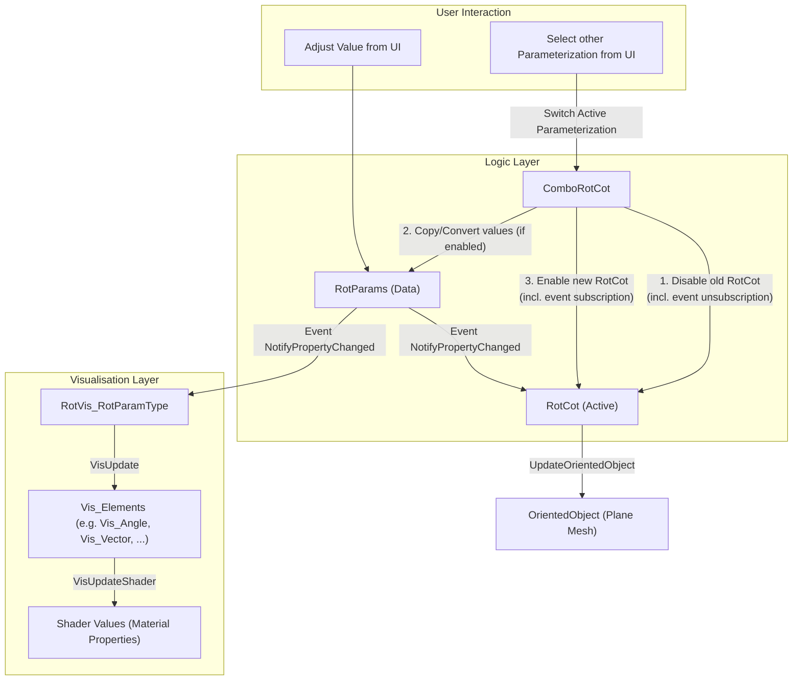

## PHASE 1 - DEFINITION

### 1. XY-Chain & Specificity (e.g. not "solve UI", but "user can't find item XY in UI":
- clean shader-access-diagram
- shader-access-hierarchy overview as diagram

### 2. Description
| **input**       | **behaviour**                         | **constraints**            | **output**                                |
|-----------------|---------------------------------------|----------------------------|-------------------------------------------|
| Script, Shaders | change in Script propagates to shader | linearity, no backtracking | clear overview of shader access hierarchy |

### 3. Rice:
| Reach (#use-cases) | Impact (0-3) | Confidence | Est. Effort |
|--------------------|--------------|------------|-------------|
| 2                  | 1            | medium     | 2h          |
Begin-Time: 2026-03-24, 16:07
Finish-Time: 

-> switch (use-case * impact): 
- <=3: brute-force <= 1h or backlog
- ~~4-6: acceptable solution <= 1day or backlog~~
- ~~\>=7: elegant solution~~

### 4. Kill Duck: 
am I creating this, only because it ... (strike-through wrong ones)
- ... is intellectually interesting?
- ... appears cool?  
- ~~... is fun to make?~~  
- ... helps an imaginary future? 
-> any yes = backlog
=> I should actually keep this minimal; no rework, just make a quick overview diagram; 
- Additionally this shows less skill / consideration than the lockableVector-class

==> Aborted

###  Workflow: : Summary : 

# ________

## PHASE 2 - DESIGN

### Research: 
switch (complexity): 
 - ~~**pre-built**: quick-check for reuse~~
 - **similar**: similarity-table 
 - ~~**custom feature**:~~ 



```mermaid

```

### Event Subscription Lifecycle
```mermaid
flowchart TD
    subgraph Initialization [Initialization / Setup]
        Init["ComboRotCot.Initialize"]
        InitRotCot["RotCot.Initialize"]
        Init --> InitRotCot
    end

    subgraph SwitchProcess [Switching Parameterization - ComboRotCot]
        DisableOld["1. Disable Old RotCot"]
        Convert["2. Convert & Copy Values"]
        EnableNew["3. Enable New RotCot"]
        
        DisableOld --> Convert --> EnableNew
    end

    subgraph RotCotLifecycle [RotCot - Active State]
        OnEnable["OnEnable"]
        SubRC["Sub: RotParams.PropertyChanged += UpdateOrientedObject"]
        
        OnDisable["OnDisable"]
        UnsubRC["Unsub: RotParams.PropertyChanged -= UpdateOrientedObject"]

        EnableNew --> OnEnable
        OnEnable --> SubRC
        OnDisable --> UnsubRC
    end

    subgraph RotVisLifecycle [RotVis - Visuals]
        SetRP["RotVis.SetRotParamsByRef"]
        UnsubOldVis["Unsub: oldRotParams.PropertyChanged -= VisUpdateOnRotParamsChanged"]
        SubNewVis["Sub: newRotParams.PropertyChanged += VisUpdateOnRotParamsChanged"]
        
        EnableNew -- "via RotCot.OnEnable" --> SetRP
        SetRP --> UnsubOldVis --> SubNewVis
    end

    subgraph PropertySetter [Direct RotParams Assignment]
        Setter["RotCot.RotParams = value"]
        UnsubS["Unsub: oldRotParams.PropertyChanged -= UpdateOrientedObject"]
        SubS["Sub: newRotParams.PropertyChanged += UpdateOrientedObject"]
        
        Setter --> UnsubS --> SubS
    end
```

###  Workflow: is research done?
### Research Summary: 

### Happy-Path: 
- **default** (<= 1day): flowchart & rubber-duck

###  Workflow: confirm happy-path
### Happy-Path Summary:

###  Workflow: confirm solution design
### Solution Summary: 

# ________

## PHASE 3 - IMPLEMENTATION

### Happy-Path: 
- implement feature-documentation
- implement solution
- implement happy-path test
- compare with design

###  workflow: test success? continue!

### Edge-Cases: 
- implement edge-case-documentation
- implement edge-case test
- implement solution
    - parameterize if necessary
    - extract if necessary
    - rename new variables/functions
    - no structural changes (= no abstraction, no extra classes)

###  workflow: tests succeed? continue!

# ________

## PHASE 4 - POSTMORTEM:

### compare: 

| planned | executed |
|---------|----------|
|         |          

work problems list: 
- meow

success list: 
- meow

| estimated time | actual time |
|----------------|-------------|
|                |             |

### recheck alternatives

# ________

## PHASE 5 - Feedback: 

Notes: 
- 